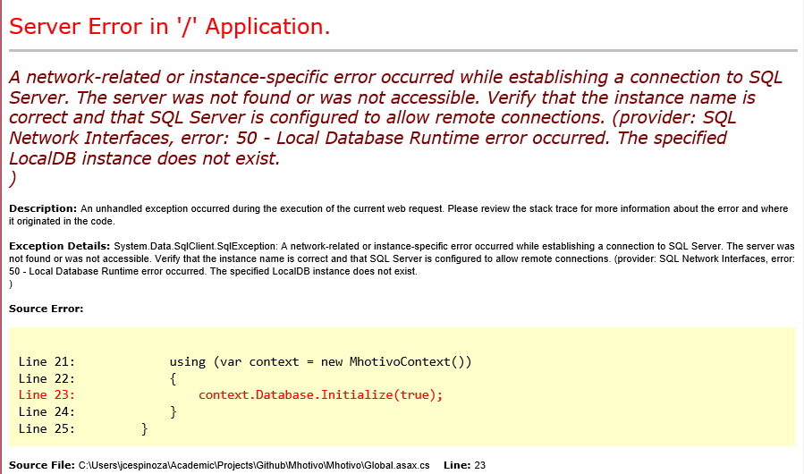
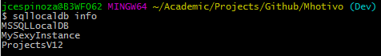
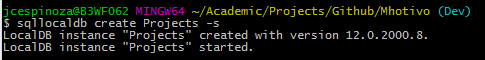

# Mhotivo

## Database Setup

In case you're getting this error when running the Web projects:



It means EntityFramework could not find the instance name specified in the Web.config file. The solution is to create the instance in our machine instead of modifying the Web.config

You can see which instances you have running on your machine y using the following command:

```cmd
sqllocaldb info
```

It would show something like this:



If the instance name the program needs is not there you can create like with the following:

```cmd
sqllocaldb create Projects -s
```

Where `Projects` is the name of the instance you need. The `-s` flag starts the instance upon creating it.

